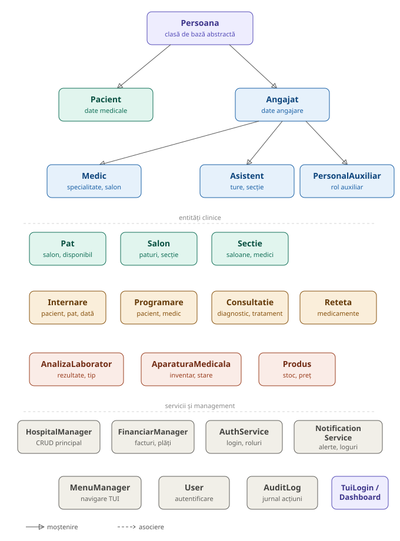

# 🏥 SpitalHIS — Hospital Information System

Sistem de management spitalicesc (HIS) dezvoltat în C++17 cu interfață TUI bazată pe **ncurses/curses**.

---

## 🗂️ Diagrama UML — Ierarhia claselor



---

## 📋 Cerințe de sistem

| Componentă | Versiune minimă |
|---|---|
| Compilator C++ | GCC 9+ / Clang 10+ / MSVC 2019+ |
| CMake | 3.16+ |
| ncurses | 6.x |
| Sistem de operare | Linux / macOS / Windows (WSL) |

### Instalare dependențe

**Ubuntu / Debian:**
```bash
sudo apt update
sudo apt install -y cmake g++ libncurses5-dev libncursesw5-dev
```

**Fedora / RHEL:**
```bash
sudo dnf install cmake gcc-c++ ncurses-devel
```

**macOS (Homebrew):**
```bash
brew install cmake ncurses
```

---

## 🚀 Compilare și rulare

### 1. Clonare repository

```bash
git clone https://github.com/VladRotaru1/3123a_Gestionare_Spital_Rotaru_Vlad-Marius.git
cd ProiectPOO
```

### 2. Configurare CMake

```bash
mkdir build
cd build
cmake ..
```

> **Opțional:** Pentru a dezactiva interfața TUI (ncurses) și a folosi consola simplă:
> ```bash
> cmake .. -DUSE_TUI=OFF
> ```

### 3. Compilare

```bash
cmake --build .
# sau echivalent:
make
```

### 4. Rulare aplicație

```bash
./SpitalHIS
```

Sau folosind scriptul din rădăcina proiectului:

```bash
cd ..           # înapoi în rădăcina proiectului
chmod +x run_tui.sh
./run_tui.sh
```

---

## 🧪 Rulare teste

Din directorul `build/`:

```bash
./Tests
```

---

## 📁 Structura proiectului

```
3123a_Gestionare_Spital_Rotaru_Vlad-Marius/
├── src/                    # Codul sursă (fișiere .cpp și .h)
│   ├── main.cpp
│   ├── Persoana.*          # Clasa de bază
│   ├── Pacient.*
│   ├── Angajat.*
│   ├── Medic.*
│   ├── Asistent.*
│   ├── PersonalAuxiliar.*
│   ├── HospitalManager.*   # Manager principal
│   ├── FinanciarManager.*
│   ├── MenuManager.*
│   ├── AuthService.*
│   ├── TuiLogin.*          # Interfață TUI (ncurses)
│   └── TuiDashboard.*
├── tests/                  # Teste unitare
│   └── test_main.cpp
├── docs/                   # Documentație
├── CMakeLists.txt
├── run_tui.sh              # Script de lansare rapidă
└── *.txt / *.log           # Fișiere de date (persistență)
```

---

## 📂 Fișiere de date

Aplicația folosește fișiere text pentru persistența datelor:

| Fișier | Conținut |
|---|---|
| `pacienti.txt` | Date pacienți |
| `medici.txt` | Date medici |
| `asistenti.txt` | Date asistenți |
| `programari.txt` | Programări consultații |
| `consultatii.txt` | Istoricul consultațiilor |
| `internari.txt` | Internări active și finalizate |
| `facturi.txt` | Facturi emise |
| `sectii.txt` | Secțiile spitalului |
| `inventar.txt` | Inventar aparatură/produse |
| `users.txt` | Conturi utilizatori |
| `audit.log` | Jurnal audit acțiuni |
| `alerte_sistem.log` | Alerte și notificări |

---

## 🔐 Autentificare

La pornire, aplicația solicită autentificarea. Conturile de test se găsesc în `users.txt`.

---

## ⚠️ Rezolvare probleme frecvente

**Eroare `ncurses not found`:**
```bash
sudo apt install libncurses5-dev libncursesw5-dev
```

**Eroare la CMake < 3.16:**
```bash
cmake --version   # verifică versiunea instalată
```

**Terminalul se strică după ieșire:**
```bash
reset
```
